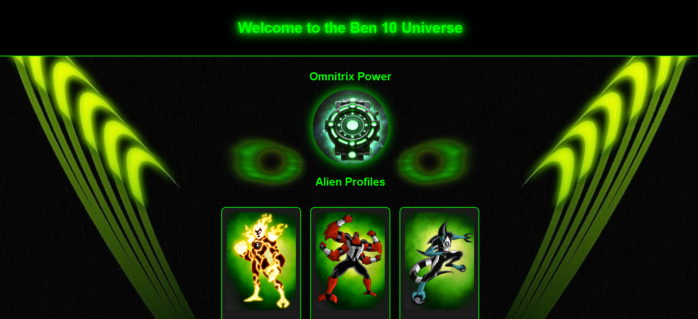
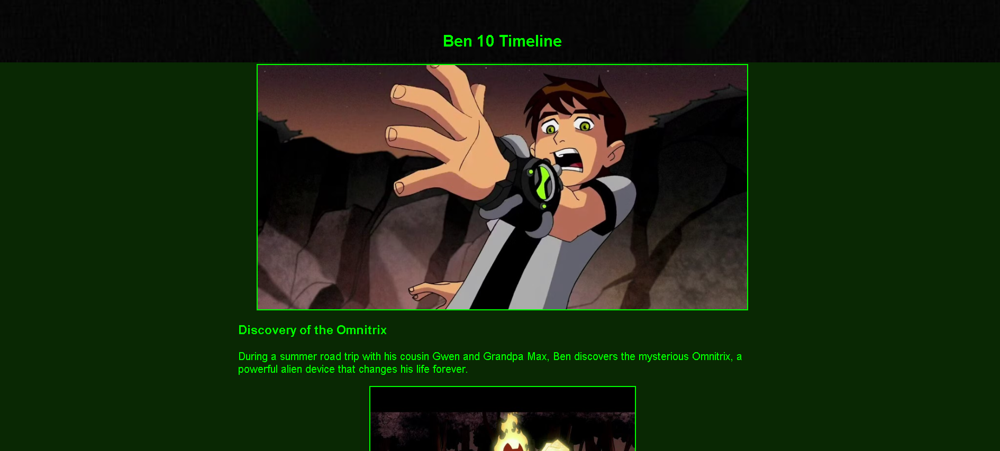
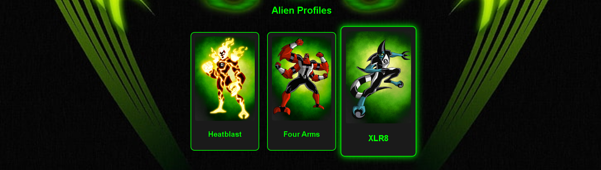

# Ben 10: A Retro Adventure

**"Ben 10: A Retro Adventure"** is a retro-themed interactive website that celebrates the iconic cartoon series *Ben 10*. Designed with a nostalgic 90s aesthetic, this project combines creativity and technology to immerse users in Ben Tennyson's universe. Explore alien profiles, pivotal moments from Ben's adventures, and interactive features that bring the Omnitrix to life!

---

## Features

### 🕹️ Retro 90s Design
- Neon green highlights, glowing elements, and pixelated typography.
- A visual homage to the 90s era of arcade games and classic cartoons.

### 🌟 Interactive Omnitrix
- A glowing Omnitrix animation that activates on click.
- Adds interactivity and engagement to the experience.

### 👾 Alien Profiles
- Profiles of fan-favorite aliens like Heatblast, Four Arms, and XLR8.
- Includes unique visuals and descriptions of each alien's abilities.

### 📜 Detailed Timeline
- A visually rich timeline of Ben’s journey, from discovering the Omnitrix to defeating alien threats.
- Each event is accompanied by custom images and descriptions.

### 🎨 Dynamic Visuals
- High-quality graphics and animations that enhance storytelling.
- Responsive design for seamless viewing across devices.

---

## Technologies Used

### 📌 Frontend
- **HTML5**: For creating a semantic, well-structured layout.
- **CSS3**: To achieve the retro-inspired design and glowing effects.
- **JavaScript**: For interactivity, animations, and dynamic elements.

### 📌 Design Tools
- **Figma**: For conceptualizing and designing the UI/UX.
- Custom graphics designed specifically for this project.

---

## How to Use

1. Clone the repository:
   ```bash
   git clone https://github.com/your-username/ben10-retro-adventure.git
   ```
2. Navigate to the project directory:
   ```bash
   cd ben10-retro-adventure
   ```
3. Open the `index.html` file in your browser.

---

## Screenshots

### Homepage


### Timeline


### Alien Profiles


---

## Future Enhancements

- **More Alien Profiles:** Expanding the list of available alien characters.
- **Interactive Mini-Games:** Adding small games inspired by *Ben 10*.
- **Thematic Music:** Incorporating the classic *Ben 10* theme song for nostalgia.

---

## Contributing

Contributions are welcome! Feel free to fork the repository and submit a pull request with your ideas.

1. Fork the repository.
2. Create a new branch:
   ```bash
   git checkout -b feature-name
   ```
3. Commit your changes:
   ```bash
   git commit -m "Added a new feature"
   ```
4. Push the branch:
   ```bash
   git push origin feature-name
   ```
5. Open a pull request.

---

## License

This project is licensed under the [MIT License](LICENSE). Feel free to use and modify it for personal or commercial use.

---

## Acknowledgements

- Inspired by the original *Ben 10* series from Cartoon Network.
- Thanks to the open-source community for tools and resources.

---

## Contact

For questions or feedback, feel free to reach out:
- **Email**: purveshmali99@gmail.com
- **GitHub**: Purveshmali (https://github.com/Purveshmali)
